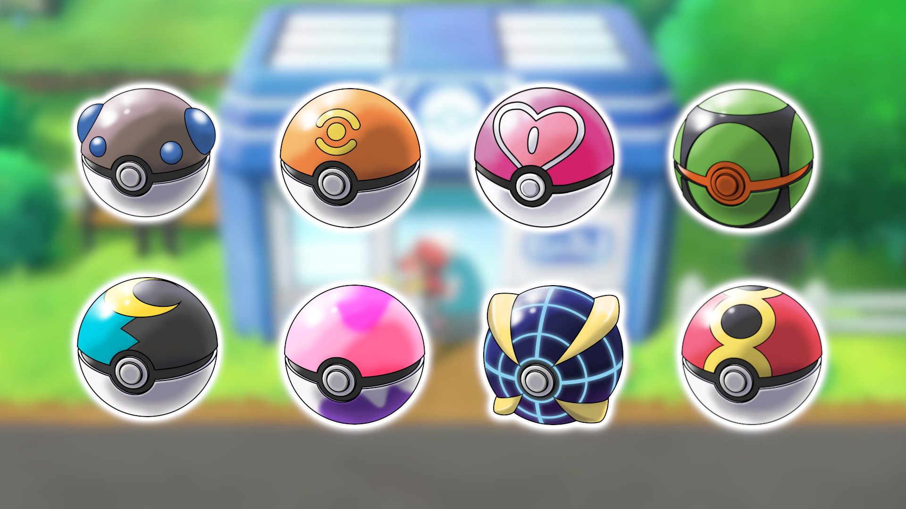

<!DOCTYPE html>
<html>
  

# MD ASSIGNMENT

<table>
  <tr>
    <td></td>
    <td>
      These are a few of the many pokeballs in the pokemon world.
    </td>
  </tr>
</table>
<a href="https://github.com/udhambains777/Knes381/blob/main/readme.md">Visit readme.me!</a>
<h2>$\dot{V}O_2$ </h2>
VO2<h2>
<h3>$\color{red}{\text{Mario}}$<h3>
<h3>$\color{green}{\text{Luigi}}$</h3>
</html>
